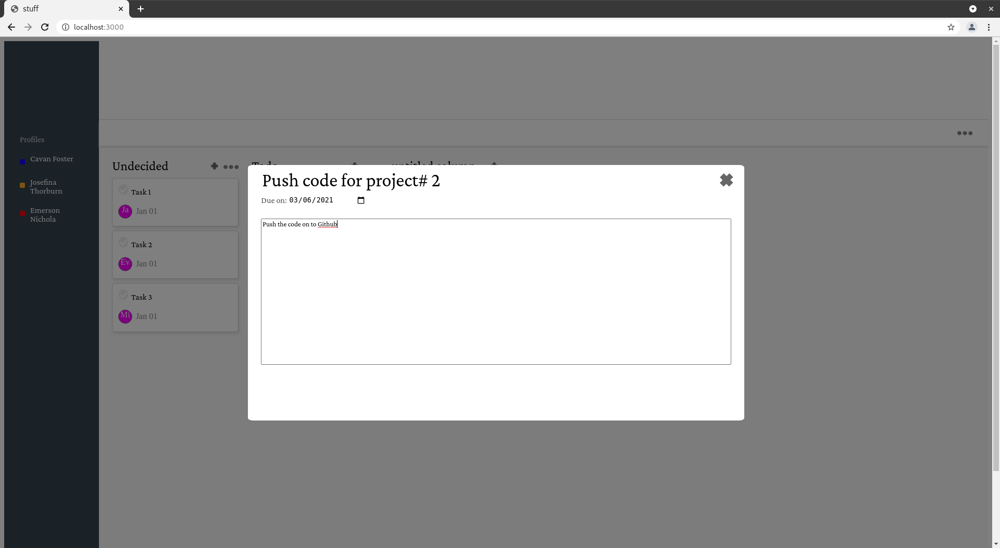
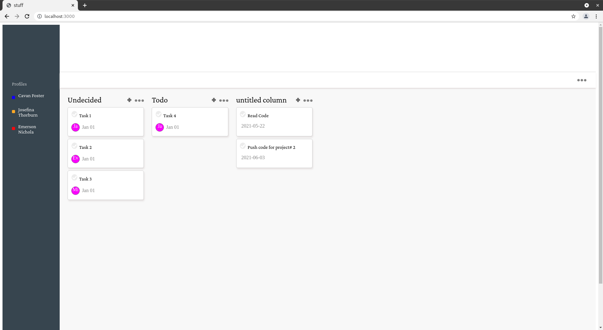

Kanban-style Board Management Software

A Kanban board to manage multiple tasks built with ReactJS and Spring and Hibernate.

# Screenshots

# TODO
- Switch between boards or profiles
- Add assignees and collaborators 

